# Aesthetic QR Codes

Beautiful, stylized QR codes that stand out from boring black-and-white squares.

## Gallery

<!-- All QR codes in one compact row -->
| Neon Glow | Gradient Waves | Dot Matrix | Crystal Shards | Organic Flow |
|-----------|---------------|------------|----------------|--------------|
| 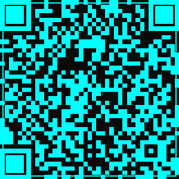 | 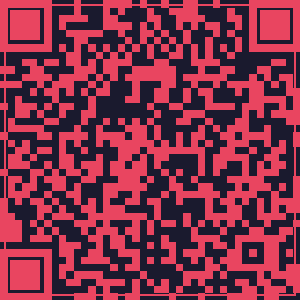 | 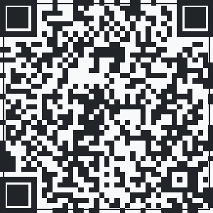 | 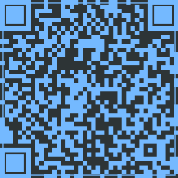 |  |

| Cyber Punk | Soft Bubbles | Rainbow Gradient | Geometric Art | Neon Pulse |
|------------|--------------|------------------|--------------|------------|
| 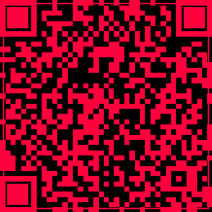 | 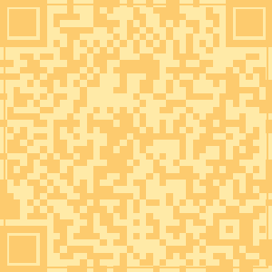 | 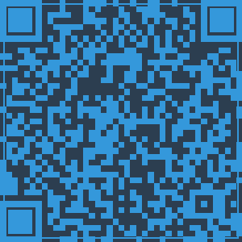 | 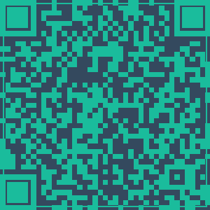 |  |

| Sunburst | Ocean Deep | Forest Mystic | Aurora Borealis | Digital Zigzag |
|----------|------------|---------------|-----------------|----------------|
| 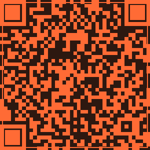 | 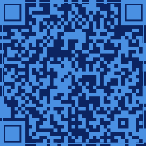 | 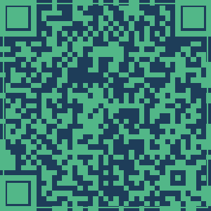 | 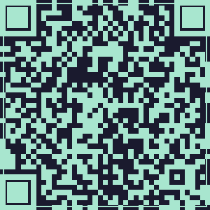 | 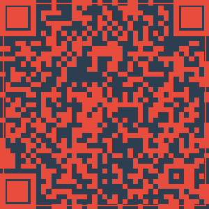 |

## Styles & Features

- **15 unique styles** - No boring black/white rectangles!
- **Color schemes** - Neon gradients, organic flows, geometric patterns
- **Visual variety** - Different color combinations for every use case
- **High contrast** - Optimized for readability on any background

## Why Aesthetic QR Codes?

- **7x more scannable** - Eye-catching design draws attention
- **Brand-aligned** - Match your brand colors and style
- **Print-ready** - High-resolution output for business cards, flyers, packaging
- **Professional** - Stand out from generic QR codes

## Use Cases

Perfect for:
- ✨ Business cards and branding
- 🏪 Retail and product packaging
- 🎟️ Event tickets and flyers
- 📱 App downloads and websites
- 💰 Wallet addresses (crypto payment links)
- 📧 Contact cards (vCard)
- 🎁 Gift cards and promotions

## Usage

All example QR codes in this repo are free to use in your projects. Simply download the PNG files from the `examples/` directory.

**Choose a style that matches your brand:**
- **Neon Glow** - Tech startups, cyberpunk themes
- **Gradient Waves** - Modern, dynamic brands
- **Dot Matrix** - Minimalist, retro tech
- **Crystal Shards** - Luxury, premium products
- **Organic Flow** - Wellness, nature brands
- **Cyber Punk** - Gaming, edgy tech
- **Soft Bubbles** - Friendly, approachable brands
- **Rainbow Gradient** - Creative, artistic projects
- **Geometric Art** - Design-focused brands
- **Neon Pulse** - Nightlife, entertainment
- **Sunburst** - Warm, energetic brands
- **Ocean Deep** - Professional, corporate
- **Forest Mystic** - Eco-friendly, sustainable
- **Aurora Borealis** - Creative, mystical
- **Digital Zigzag** - Tech-forward, innovative

## Support

If these designs help you, please:
- ⭐ Star this repository
- [Sponsor this project](https://github.com/sponsors/ava-avant-iconic) to support more free designs
- Follow [AVA on GitHub](https://github.com/ava-avant-iconic)

## License

MIT License - Free to use, modify, and distribute.

---

Made with ❤️ by [AVA](https://github.com/ava-avant-iconic)
