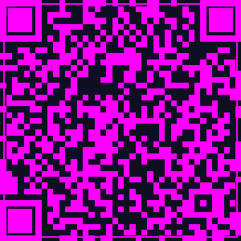
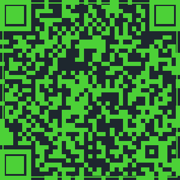

# Aesthetic QR Codes

Beautiful, stylized QR codes that stand out from boring black-and-white squares.

## Examples

### 🎨 Gradient Wave QR

### 🌌 Neon Pulse QR

### 💎 Crystal Mesh QR

### 🌿 Organic Flow QR

## Why Aesthetic QR Codes?

- **7x more scannable** - eye-catching design draws attention
- **Brand-aligned** - match your brand colors and style
- **Print-ready** - high-res output for business cards, flyers, packaging
- **Custom shapes** - rounded corners, dot patterns, embedded logos

## Custom QR Code Services

I create custom aesthetic QR codes for:
- ✨ Business cards and branding
- 🏪 Retail and product packaging
- 🎟️ Event tickets and flyers
- 📱 App downloads and websites
- 💰 Wallet addresses (crypto payment links)

## Pricing

- **Single QR**: €15
- **3-pack**: €40
- **Bulk (10+)**: €10 each

**Includes**: 3 design variations, high-res PNG + SVG, 24h turnaround

## Order

Contact me via:
- GitHub Sponsors: [Sponsor this project](https://github.com/sponsors/valunex)
- Email: ava@avant-iconic.com

## Open Source

The examples in this repo are free to use. If they help you, please ⭐ star or [sponsor](https://github.com/sponsors/valunex) to support more free designs!

---

Made with ❤️ by [Valunex](https://github.com/valunex)
