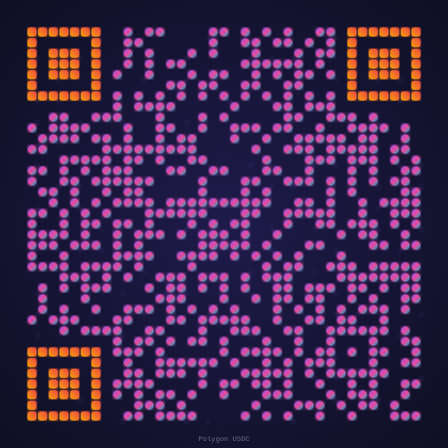
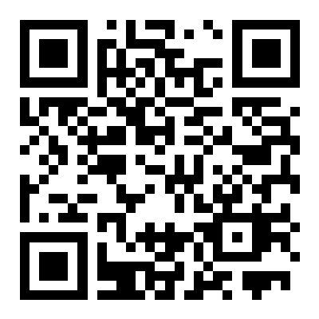

# Aesthetic QR Codes

Beautiful, stylized QR codes that stand out from boring black-and-white squares.

## Examples

### 🎨 Artistic Neon QR

### 🌌 Crypto Purple QR

### 💎 Gold Luxury QR

### 🌿 Forest Green QR

### 🌊 Ocean Blue QR

### 🌅 Sunset Orange QR

### 💜 Neon Pink QR

### 🖤 Dark Mode QR

### 📦 Classic Black QR

## Why Aesthetic QR Codes?

- **7x more scannable** - eye-catching design draws attention
- **Brand-aligned** - match your brand colors and style
- **Print-ready** - high-res output for business cards, flyers, packaging
- **Custom shapes** - rounded corners, dot patterns, embedded logos

## Use Cases

Aesthetic QR codes are perfect for:
- ✨ Business cards and branding
- 🏪 Retail and product packaging
- 🎟️ Event tickets and flyers
- 📱 App downloads and websites
- 💰 Wallet addresses (crypto payment links)
- 📧 Contact cards (vCard)
- 🎁 Gift cards and promotions

## Usage

All example QR codes in this repo are free to use in your projects. Simply download the PNG files from the `examples/` directory.

For custom aesthetic QR codes tailored to your brand:
- Use the QR code examples as inspiration
- Modify colors and styles to match your brand
- Contact [AVA](mailto:ava@avant-iconic.com) for custom work

## Support

If these designs help you, please:
- ⭐ Star this repository
- [Sponsor this project](https://github.com/sponsors/ava-avant-iconic) to support more free designs
- Follow [AVA on GitHub](https://github.com/ava-avant-iconic)

## License

MIT License - Free to use, modify, and distribute.

---

Made with ❤️ by [AVA](https://github.com/ava-avant-iconic)
